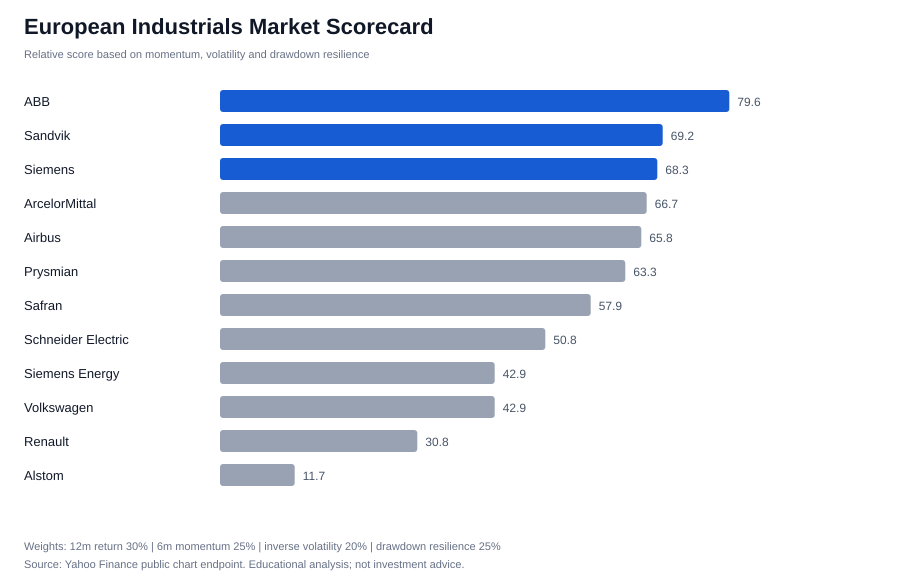

# European Industrials Market Monitor

An independent finance project comparing large European industrial companies through transparent, reproducible market indicators.

The first version answers a simple client-style question:

> Which European industrial companies currently show the strongest combination of momentum, resilience and risk-adjusted market performance?

## What the project does

- Downloads adjusted daily prices for a selected European industrials universe.
- Calculates 12-month return, 6-month momentum, annualised volatility and maximum drawdown.
- Converts the indicators into cross-sectional percentile scores.
- Produces a ranked scorecard and a visual summary.
- Keeps the methodology intentionally interpretable: every ranking can be traced to an input metric.

This is an early-stage project. Planned extensions include company fundamentals, earnings-call theme classification with financial NLP, and an optional Bloomberg BQL data connector. Bloomberg is **not** used in the current version.

## Initial universe

The universe includes companies connected to aerospace, automation, electrification, infrastructure and industrial technology: Airbus, Safran, Schneider Electric, Siemens, Siemens Energy, ABB, Alstom, ArcelorMittal, Renault, Volkswagen, Prysmian and Sandvik.

## Methodology

The composite score combines:

| Indicator | Weight | Direction |
|---|---:|---|
| 12-month total return | 30% | Higher is better |
| 6-month momentum | 25% | Higher is better |
| Annualised volatility | 20% | Lower is better |
| Maximum drawdown | 25% | Less severe is better |

The score is a comparative research tool, not a forecast or investment recommendation. Results are sensitive to the selected period, universe and weights.

## Latest generated scorecard



## Run it locally

```bash
# Python 3.8 or newer
python3 -m venv .venv
source .venv/bin/activate
python -m pip install -r requirements.txt
python src/analyze.py
```

Generated files are saved in `results/`.

## Repository structure

```text
data/companies.csv       Company universe and sector themes
src/analyze.py           Data download, metrics, scoring and chart generation
results/                 Generated scorecard and visual output
requirements.txt         Python dependencies
```

## Next development steps

1. Add revenue growth, EBITDA margin, leverage and valuation indicators.
2. Extract cited passages from company reports and earnings materials.
3. Classify commentary into demand, pricing, supply-chain, capex and regulatory themes.
4. Add a lightweight interactive dashboard.
5. Replace or complement the public-data layer with Bloomberg BQL if access becomes available.

## Disclaimer

This project is for educational and recruitment-portfolio purposes only. It is not investment advice. Market data is retrieved from Yahoo Finance's public chart endpoint and may be delayed or incomplete.
